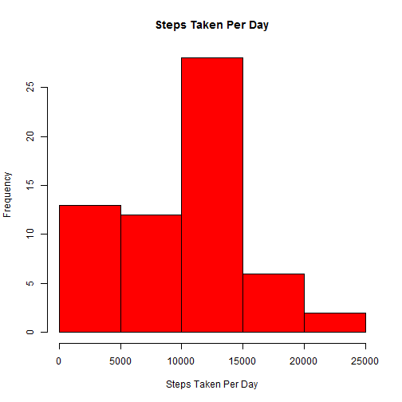
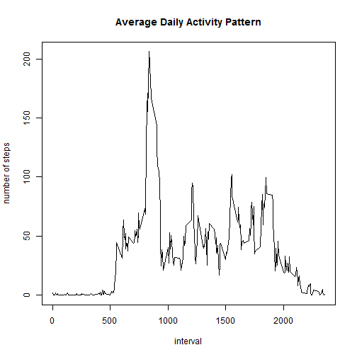
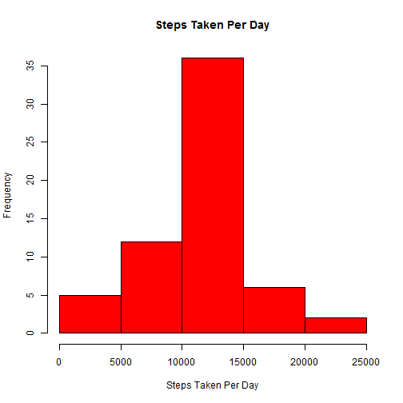
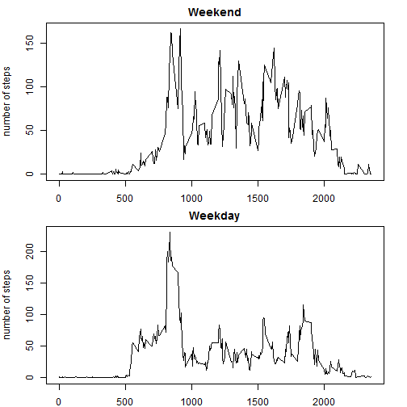

# Reproducible Research: Peer Assessment 1

This assignment makes use of data from a personal activity monitoring device. It conducts exploratory analysis on number of steps for each day and each kind of 5-min interval. 

## Loading and preprocessing the data

1 Load the data


```r
setwd("C:/Users/yanyan/Documents/R/data")
unzip("activity.zip")
data=read.csv("activity.csv")
```

2 Process/transform the data (if necessary) into a format suitable for your analysis:


```r
data1=data[!is.na(data$steps),]
s_date1=split(data1$steps,data1$date)
steps_daily1=sapply(s_date1,sum)
```

## What is mean total number of steps taken per day?

1 Make a histogram of the total number of steps taken each day


```r
hist(steps_daily1,col="red",main = "Steps Taken Per Day",xlab= "Steps Taken Per Day")
```

 

2 Calculate and report the mean and median total number of steps taken per day


```r
daily_mean1=mean(steps_daily1)
daily_median1=median(steps_daily1)
print(daily_mean1)
```

```
## [1] 9354
```

```r
print(daily_median1)
```

```
## [1] 10395
```

## What is the average daily activity pattern?

1 Make a time series plot of the 5-minute interval (x-axis) and the average number of steps taken, averaged across all days (y-axis)


```r
s_interval=split(data1$steps,data1$interval)
steps_interval_mean=sapply(s_interval,mean)
v_interval=as.numeric(names(steps_interval_mean))
plot(v_interval,steps_interval_mean,type="l",main="Average Daily Activity Pattern",xlab="interval",ylab="number of steps")
```

 

2 Which 5-minute interval, on average across all the days in the dataset, contains the maximum number of steps?


```r
max_idx=v_interval[which.max(steps_interval_mean)]
print(max_idx)
```

```
## [1] 835
```

##Imputing missing values

1 Calculate and report the total number of missing values in the dataset


```r
v_NA=is.na(data$steps)
num_NAs=sum(v_NA)
print(num_NAs)
```

```
## [1] 2304
```

2 filling in all of the missing values in the dataset  
3 Create a new dataset that is equal to the original dataset but with the missing data filled in.


```r
data2=data
na_interval=data2$interval[v_NA]
idx_interval=match(na_interval,v_interval)
data2$steps[v_NA]=steps_interval_mean[idx_interval]
```

4 Make a histogram of the total number of steps taken each day and Calculate and report the mean and median total number of steps taken per day.


```r
s_date2=split(data2$steps,data2$date)
steps_daily2=sapply(s_date2,sum)
hist(steps_daily2,col="red",main = "Steps Taken Per Day",xlab= "Steps Taken Per Day")
```

 

```r
daily_mean2=mean(steps_daily2)
daily_median2=median(steps_daily2)
print(daily_mean2)
```

```
## [1] 10766
```

```r
print(daily_median2)
```

```
## [1] 10766
```

both of the mean and median differ from the estimates from the first part of the assignment

imputing missing data on the estimates introduce bias into the total daily number of steps?

## Are there differences in activity patterns between weekdays and weekends?

1 create a new factor with weekday and weekend


```r
v_weekdays=weekdays(as.Date(data2$date))
data2$weekdays=factor(ifelse(v_weekdays %in% c("Saturday","Sunday"),"weekend","weekday"))
s_weekdays=split(data2,data2$weekdays)
data_weekday=as.data.frame(s_weekdays[1])
s_interval_weekday=split(data_weekday[[1]],data_weekday[[3]])
weekday_mean=sapply(s_interval_weekday,mean)

data_weekend=as.data.frame(s_weekdays[2])
s_interval_weekend=split(data_weekend[,1],data_weekend[,3])
weekend_mean=sapply(s_interval_weekend,mean)
```

2 Make a panel plot containing a time series plot of the 5-minute interval (x-axis) and the average number of steps taken, averaged across all weekday days or weekend days (y-axis).


```r
par(mfrow=c(2,1),mar=c(2,4,2,2)) #margin:bottom,left,up,right
plot(v_interval,weekend_mean,type="l",main="Weekend",xlab="interval",ylab="number of steps")
plot(v_interval,weekday_mean,type="l",main="Weekday",xlab="interval",ylab="number of steps")
```

 
